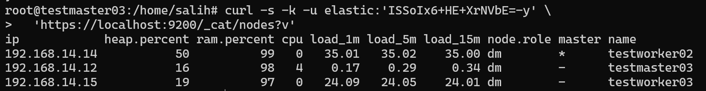
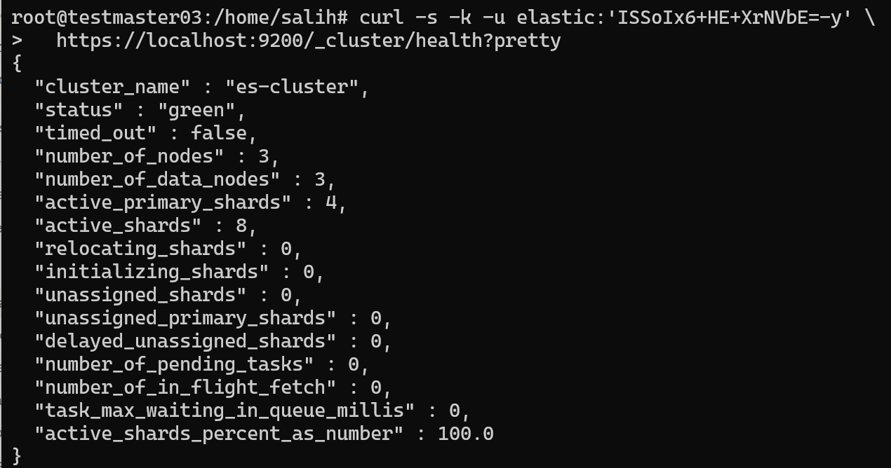
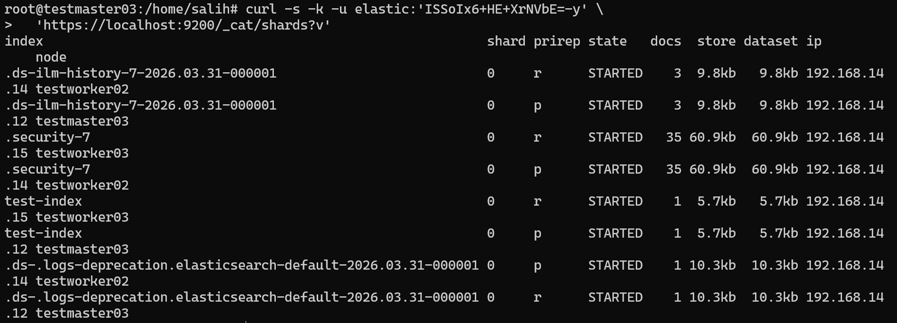
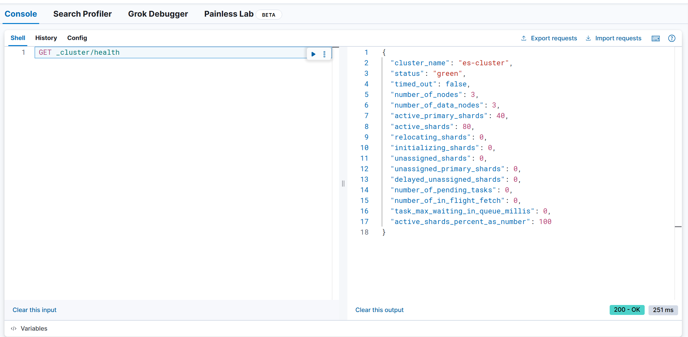
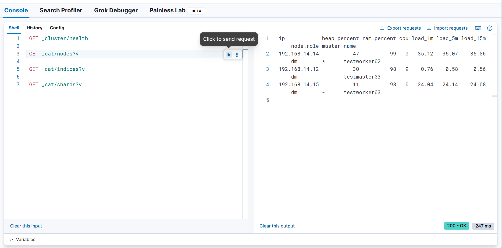

# Elasticsearch 3-Node HA Cluster Kurulumu

## Ortam Bilgileri

| Node | IP Adresi |
|------|-----------|
| testmaster03 | 192.168.14.12 | 
| testworker02 | 192.168.14.14 | 
| testworker03 | 192.168.14.15 | 

> **Not:** 3 adet Ubuntu 20.04 LTS makine kullanılmıştır. 

---

## 1. Sistem Kontrolü

Kuruluma başlamadan önce 3 node'un disk, RAM, CPU ve ağ bağlantısının kontrol edilmesinde fayda var.

**3 node'da da çalıştır:**

```bash
free -h && df -h /
```

Node'ların birbirini görebildiğini doğrulayabiliriz:

```bash
ping -c 2 192.168.14.12
ping -c 2 192.168.14.14
ping -c 2 192.168.14.15
```

Firewall durumunu kontrol et:

```bash
ufw status
```

`Status: inactive` çıkmalıdır. Aktifse 9200 ve 9300 portlarını açmalısınız:

```bash
ufw allow 9200/tcp
ufw allow 9300/tcp
```

 **Elasticsearch için minimum gereksinimler:**
 - RAM: en az 4 GB (önerilen 8 GB+)
 - Swap: kapalı olmalı

---

## 2. vm.max_map_count Ayarı

Elasticsearch veriyi diske yazarken `mmap` (memory-mapped files) tekniğini kullanır. Linux çekirdeği bu eşleme sayısını sınırlar. Resmi dokümantasyon Elasticsearch 8.16+ için minimum **1048576** değerini zorunlu kılıyor. Bu değer düşük olursa ES başlamayı reddedebilir.

**3 node'da da çalıştır:**

```bash
# Anlık uygulamak için:
sysctl -w vm.max_map_count=1048576

# Kalıcı yapmak için:
echo "vm.max_map_count=1048576" >> /etc/sysctl.conf

# Doğrulayalım:
sysctl vm.max_map_count
```

Çıktı `vm.max_map_count = 1048576` olmalıdır.

---

## 3. Elasticsearch Kurulumu

Aşağıdaki adımları **testmaster03, testworker02 ve testworker03** üzerinde sırayla uygulayalım.

### 3.1 GPG Anahtarı Ekleme

APT indirdiği her paketi dijital imzayla doğrular. Bu komut Elastic'in resmi imza anahtarını sisteme ekler. Olmadan APT `NO_PUBKEY` hatası verir ve paketi kurmayı reddeder.


```bash
wget -qO - https://artifacts.elastic.co/GPG-KEY-elasticsearch | \
  gpg --dearmor -o /usr/share/keyrings/elasticsearch-keyring.gpg
```

### 3.2 APT Repository Ekleme

Elastic'in resmi 8.x paket deposunu APT'ye tanıtıyoruz. `signed-by` parametresi bu repo'dan gelen paketlerin hangi GPG anahtarıyla doğrulanacağını belirtir.

```bash
apt-get install -y apt-transport-https

echo "deb [signed-by=/usr/share/keyrings/elasticsearch-keyring.gpg] \
  https://artifacts.elastic.co/packages/8.x/apt stable main" | \
  tee /etc/apt/sources.list.d/elastic-8.x.list
```

### 3.3 Paketi Kurma

`apt-get update` yeni eklediğimiz Elastic repo'sunun paket listesini çeker. Kurulum sırasında Debian paketi otomatik olarak TLS sertifikaları üretir, `xpack.security` aktif eder ve `elastic` superuser şifresi oluşturur.


```bash
apt-get update  
apt-get install elasticsearch
```

> **Kurulum bitince terminale `elastic` kullanıcısının şifresi yazdırılır. Bu şifreyi bir yerlere kaydetmelisiniz. Her node'da farklı şifre üretilir.**

### 3.4 Servisi Şimdilik Devre Dışı Bırak

Config yazılmadan servis başlatılırsa her node kendi başına ayrı bir single-node cluster oluşturur. Önce tüm config'ler yazılacak, sonra node'lar sırayla başlatılacak hedefimiz bu.

```bash
systemctl disable elasticsearch
```

---

## 4. systemd Override — bootstrap.memory_lock

`bootstrap.memory_lock: true` ayarı ES'in JVM heap'ini RAM'e kilitler, swap'a taşınmasını engeller. Debian paketinde bu izin systemd üzerinden verilir. `LimitMEMLOCK=infinity` systemd'ye "bu servis için bellek kilitleme sınırı koyma" der.

Doğrudan servis dosyasını düzenlemek yerine override dosyası kullanılır çünkü paket güncellendiğinde orijinal servis dosyası sıfırlanır — override dosyası etkilenmez.

**Resmi dokümantasyon:** *"RPM and Debian: Set LimitMEMLOCK to infinity in the systemd configuration"* — Disable swapping, Enable bootstrap.memory_lock.

**3 node'da da çalıştır:**

```bash
mkdir -p /etc/systemd/system/elasticsearch.service.d

cat > /etc/systemd/system/elasticsearch.service.d/override.conf << 'EOF'
[Service]
LimitMEMLOCK=infinity
EOF
```

Doğrula:

```bash
cat /etc/systemd/system/elasticsearch.service.d/override.conf
```

---

## 5. testmaster03 Konfigürasyonu

Enrollment token yöntemi kullanıldığı için önce sadece testmaster03 yapılandırılır ve başlatılır. Diğer node'lar sonradan token ile cluster'a eklenecektir.

**Neden bu yöntem:** Resmi dokümantasyonun önerdiği yöntemdir. Token içinde cluster'ın TLS sertifika bilgileri şifreli olarak gömülüdür. Token ile katılan node `transport.p12` sertifikasını otomatik alır. Manuel sertifika kopyalamaya gerek kalmaz.(Manuel base64)

**Sadece testmaster03'te çalıştırın:**

```bash
cp /etc/elasticsearch/elasticsearch.yml /etc/elasticsearch/elasticsearch.yml.bak

vim /etc/elasticsearch/elasticsearch.yml
```

```yaml
cluster.name: es-cluster
node.name: testmaster03
node.roles: [ master, data ]

path.data: /var/lib/elasticsearch
path.logs: /var/log/elasticsearch

network.host: 0.0.0.0
network.publish_host: 192.168.14.12
http.port: 9200
transport.host: 0.0.0.0
transport.publish_host: 192.168.14.12

discovery.seed_hosts:
  - 192.168.14.12
  - 192.168.14.14
  - 192.168.14.15

cluster.initial_master_nodes:
  - testmaster03

xpack.security.enabled: true
xpack.security.enrollment.enabled: true

xpack.security.http.ssl:
  enabled: true
  keystore.path: certs/http.p12

xpack.security.transport.ssl:
  enabled: true
  verification_mode: certificate
  keystore.path: certs/transport.p12
  truststore.path: certs/transport.p12

bootstrap.memory_lock: true
```


> **Önemli config parametreleri:**
> - `cluster.name` — 3 node'da aynı olmalı, ES aynı isimli node'ları birleştirir
> - `node.name` — her node'da farklı olmalı
> - `network.publish_host` — ES'in HTTP katmanında diğer node'lara kendini hangi IP ile tanıtacağı
> - `transport.publish_host` — ES'in transport katmanında (9300) diğer node'lara kendini hangi IP ile tanıtacağı. 
> - `cluster.initial_master_nodes` — sadece ilk bootstrap için, sadece bu node'un adı yazılır, cluster kurulduktan sonra kaldırılır
> - `bootstrap.memory_lock` — JVM heap'i RAM'e kilitler

Doğrula:

```bash
grep -E "cluster.name|node.name|network|transport|bootstrap|initial_master" \
  /etc/elasticsearch/elasticsearch.yml
```

---

## 6. testmaster03'ü Başlatma

**Sadece testmaster03'te çalıştır:**

```bash
systemctl daemon-reload
systemctl enable elasticsearch
systemctl start elasticsearch
```

20-30 saniye bekle, durum kontrol et:

```bash
systemctl status elasticsearch --no-pager
```

`Active: active (running)` ve `Drop-In: override.conf` görünmelidir.

Cluster sağlığını doğrulamak için:

```bash
curl -s -k -u elastic:'<TESTMASTER03_SIFRESI>' \
  https://localhost:9200/_cluster/health?pretty
```

`status: green`, `number_of_nodes: 1` beklenen çıktıdır.

Transport ve HTTP adreslerinin doğru IP'yi kullandığını doğrulamak için:

```bash
grep -E "publish_address" /var/log/elasticsearch/es-cluster.log | tail -4
```

Her iki satırda da `192.168.14.12` görünmelidir:

```
publish_address {192.168.14.12:9300}   ← transport
publish_address {192.168.14.12:9200}   ← HTTP
```

---

## 7. Enrollment Token Üret

testworker02 ve testworker03'ün cluster'a katılması için token oluşturulur. Token içinde cluster'ın TLS sertifika bilgileri ve bağlantı adresi şifreli olarak gömülüdür. 

**Resmi dokümantasyon:** *"On any node in your existing cluster, generate a node enrollment token. An enrollment token has a lifespan of 30 minutes."* — Install Elasticsearch with a Debian Package, Step 3.

**Sadece testmaster03'te çalıştır:**

```bash
/usr/share/elasticsearch/bin/elasticsearch-create-enrollment-token -s node
```

Çıkan token'ı kopyala. Token 30 dakika geçerlidir. Her yeni node için ayrı token üretilmesi önerilir.

---

## 8. testworker02'yi Cluster'a Ekle

### 8.1 Enrollment Token Uygula

Bu komut token içindeki bilgileri çözümleyerek node'u cluster'a katılacak şekilde yeniden yapılandırır. testmaster03'teki `transport.p12` sertifikasını otomatik kopyalar ve TLS keystore parolalarını `elasticsearch.keystore`'a yazar.

**Resmi dokümantasyon:** *"On your new Elasticsearch node, pass the enrollment token as a parameter to the elasticsearch-reconfigure-node tool"* — Install Elasticsearch with a Debian Package, Step 3.

**Sadece testworker02'de çalıştır:**

```bash
/usr/share/elasticsearch/bin/elasticsearch-reconfigure-node \
  --enrollment-token <TOKEN>
```

Soru sorarsa `y` ile onayla.

### 8.2 Config'i Düzenle

```bash
# Kubernetes IP'li seed_hosts satırları silin (VARSA)
sed -i '/discovery.seed_hosts: \[/d' /etc/elasticsearch/elasticsearch.yml

# http.host satırını sil (Kubernetes IP'ye bağlıyor) (VARSA)
sed -i '/^http.host:/d' /etc/elasticsearch/elasticsearch.yml

# Doğru ayarları ekleyin
vim /etc/elasticsearch/elasticsearch.yml
```

```yaml
cluster.name: es-cluster
node.name: testworker02
node.roles: [ master, data ]

network.host: 0.0.0.0
network.publish_host: 192.168.14.14
http.port: 9200
http.publish_host: 192.168.14.14
transport.publish_host: 192.168.14.14

discovery.seed_hosts:
  - 192.168.14.12
  - 192.168.14.14
  - 192.168.14.15

bootstrap.memory_lock: true
```

Doğrulamak için:

```bash
grep -E "cluster.name|node.name|publish_host|seed_hosts|bootstrap" \
  /etc/elasticsearch/elasticsearch.yml
```

### 8.3 testworker02'yi Başlat

```bash
systemctl daemon-reload
systemctl enable elasticsearch
systemctl start elasticsearch
```

20-30 saniye bekleyin, publish adreslerini doğrulayın:

```bash
grep -E "publish_address" /var/log/elasticsearch/es-cluster.log | tail -4
```

Her iki satırda da `192.168.14.14` görünmelidir

```
publish_address {192.168.14.14:9300}   ← transport
publish_address {192.168.14.14:9200}   ← HTTP
```

---

## 9. testworker03'ü Cluster'a Ekle

### 9.1 Yeni Enrollment Token Üret

**Sadece testmaster03'te çalıştır:**

```bash
/usr/share/elasticsearch/bin/elasticsearch-create-enrollment-token -s node
```

### 9.2 Enrollment Token Uygula

**Sadece testworker03'te çalıştır:**

```bash
/usr/share/elasticsearch/bin/elasticsearch-reconfigure-node \
  --enrollment-token <TOKEN>
```

Soru sorarsa `y` ile onayla.

### 9.3 Config'i Düzenle

```bash
# Kubernetes IP'li seed_hosts satırları silin (VARSA)
sed -i '/discovery.seed_hosts: \[/d' /etc/elasticsearch/elasticsearch.yml

# http.host satırını sil (Kubernetes IP'ye bağlıyor) (VARSA)
sed -i '/^http.host:/d' /etc/elasticsearch/elasticsearch.yml

# Doğru ayarları ekleyin
vim /etc/elasticsearch/elasticsearch.yml
```

```yaml
cluster.name: es-cluster
node.name: testworker03
node.roles: [ master, data ]

network.host: 0.0.0.0
network.publish_host: 192.168.14.15
http.port: 9200
http.publish_host: 192.168.14.15
transport.publish_host: 192.168.14.15

discovery.seed_hosts:
  - 192.168.14.12
  - 192.168.14.14
  - 192.168.14.15

bootstrap.memory_lock: true
```

Doğrulamak için:

```bash
grep -E "cluster.name|node.name|publish_host|seed_hosts|bootstrap" \
  /etc/elasticsearch/elasticsearch.yml
```

### 9.4 testworker03'ü Başlat

```bash
systemctl daemon-reload
systemctl enable elasticsearch
systemctl start elasticsearch
```

20-30 saniye bekleyin, publish adreslerini doğrulayın:

```bash
grep -E "publish_address" /var/log/elasticsearch/es-cluster.log | tail -4
```

Her iki satırda da `192.168.14.15` görünmelidir.

---

## 10. initial_master_nodes Temizliği

Cluster başarıyla oluştuktan sonra `cluster.initial_master_nodes` parametresi config'den kaldırılmalıdır. Bu parametre yalnızca ilk bootstrap için kullanılır. Config'de kalması node restart'larında split-brain riskine yol açar.

**Split-brain nedir:** Bir node restart olduğunda `initial_master_nodes` görürse kendini yeni bir cluster'ın master'ı ilan edebilir. Artık 2 ayrı cluster çalışır, aynı index'e farklı veriler yazılır. veri tutarsızlığı ve veri kaybı riski ortaya çıkabilir.

**Resmi dokümantasyon:** *"After the cluster forms successfully for the first time, remove the cluster.initial_master_nodes setting from each node's configuration and never set it again for this cluster."*

**Sadece testmaster03'te çalıştır** (diğer node'larda enrollment token bu satırı zaten yazmadı):

```bash
sed -i '/^cluster\.initial_master_nodes:/,/^  - testmaster03/d' \
  /etc/elasticsearch/elasticsearch.yml

grep "initial_master_nodes" /etc/elasticsearch/elasticsearch.yml || \
  echo "Temizlendi"
```

testmaster03'ü yeniden başlat:

```bash
systemctl restart elasticsearch
```

---

## 11. Kurulum Doğrulama Testleri

### 11.1 Cluster Sağlık Durumu

```bash
curl -s -k -u elastic:'<TESTMASTER03_SIFRESI>' \
  https://localhost:9200/_cluster/health?pretty
```

Beklenen çıktı:

```json
{
  "cluster_name" : "es-cluster",
  "status" : "green",
  "number_of_nodes" : 3,
  "number_of_data_nodes" : 3,
  "active_shards" : 6,
  "unassigned_shards" : 0,
  "active_shards_percent_as_number" : 100.0
}
```

### 11.2 Node Listesi

```bash
curl -s -k -u elastic:'<TESTMASTER03_SIFRESI>' \
  'https://localhost:9200/_cat/nodes?v'
```

Beklenen çıktı — 3 node, hepsi fiziksel LAN IP'siyle, birinde `*` (aktif master):

```
ip            heap.percent ram.percent cpu node.role master name
192.168.14.12     18          96        5    dm        *      testmaster03
192.168.14.14      9          99        0    dm        -      testworker02
192.168.14.15     10          99        0    dm        -      testworker03
```

### 11.3 bootstrap.memory_lock Doğrulama

`bootstrap.memory_lock: true` config'e yazmak yetmez — sistemin izin vermesi de gerekir. Bu komut gerçekten uygulandığını doğrular.

**Resmi dokümantasyon:** *"After starting Elasticsearch, you can see whether this setting was applied successfully by checking the value of mlockall."*

```bash
curl -s -k -u elastic:'<TESTMASTER03_SIFRESI>' \
  'https://localhost:9200/_nodes?filter_path=**.mlockall&pretty'
```

3 node'da da `"mlockall": true` görünmelidir.

### 11.4 Veri Yazma ve Okuma Testi

Bir node'a veri yazalım:

```bash
curl -s -k -u elastic:'<TESTMASTER03_SIFRESI>' \
  -X POST https://192.168.14.12:9200/test-index/_doc/1 \
  -H 'Content-Type: application/json' \
  -d '{"mesaj": "merhaba cluster", "tarih": "2026-03-31"}'
```

**Farklı bir node'dan** aynı veriyi okuyalım:

```bash
curl -s -k -u elastic:'<TESTMASTER03_SIFRESI>' \
  https://192.168.14.14:9200/test-index/_doc/1?pretty
```

Veri başarıyla dönüyorsa distributed search çalışıyor demektir.

### 11.5 Node Düşürme Testi

Bir node'u durdurun:

```bash
# testworker03'te
systemctl stop elasticsearch
```

Cluster durumunu kontrol edin:

```bash
# testmaster03'te
curl -s -k -u elastic:'<TESTMASTER03_SIFRESI>' \
  https://localhost:9200/_cluster/health?pretty
```

Beklenen: `"status": "yellow"`, `"number_of_nodes": 2` — cluster çalışmaya devam eder, veri erişilebilir kalır.

Node'u geri getirelim:

```bash
# testworker03'te
systemctl start elasticsearch
```

30 saniye bekle, tekrar kontrol et — `"status": "green"` ve `"number_of_nodes": 3` dönmelidir. Otomatik iyileşme çalışıyor demektir.

---

## 12. Kurulum Ekran Görüntüleri

Aşağıdaki ekran görüntüleri, 3 node'lu cluster'ın başarıyla kurulduğunu ve sağlıklı çalıştığını doğrulamaktadır.

### 12.1 Cluster Sağlık Durumu



`/_cluster/health` endpoint'ine yapılan sorgunun çıktısı. `status: green` cluster'ın tam sağlıklı olduğunu, `number_of_nodes: 3` üç node'un da aktif olduğunu, `unassigned_shards: 0` ise tüm shardların node'lara atandığını doğrular. `active_shards_percent_as_number: 100.0` ile shard dağılımı eksiksiz tamamlanmıştır.

### 12.2 Shard Dağılımı



`/_cat/shards` çıktısı, tüm index'lerin shard'larının (`p` = primary, `r` = replica) farklı node'lara dağıtıldığını gösterir. Her shard `STARTED` durumundadır ve hiçbiri `UNASSIGNED` değildir. `test-index`'in primary shardı `testmaster03`'te, replica'sı ise `testworker03`'te konumlanmıştır — bu beklenen HA davranışıdır.

### 12.3 Node Listesi ve Aktif Master



`/_cat/nodes` çıktısı, 3 node'un da fiziksel LAN IP'leriyle (`192.168.14.x`) cluster'a katıldığını doğrular. `testworker02` üzerindeki `*` işareti bu node'un aktif master seçildiğini gösterir. Tüm node'lar `dm` (data + master eligible) rolüne sahiptir. RAM kullanımının yüksek görünmesi (`97-99%`) JVM heap'inin `bootstrap.memory_lock: true` ile RAM'e kilitlenmesinden kaynaklanmaktadır — beklenen ve sağlıklı bir durumdur.

---

## 13. Kibana Kurulumu

Kibana, Elasticsearch cluster'ını görsel arayüzle yönetmek ve sorgulamak için kullanılır. Sadece **testmaster03'e** kurulur — Kibana ES cluster'ına bağlanan bir arayüzdür, kendisi cluster oluşturmaz.

> **Not:** Elasticsearch kurulumunda eklenen Elastic APT repo'su Kibana paketini de içerir, ekstra repo eklemeye gerek yoktur.

### 13.1 Kibana Kurulumu

**Sadece testmaster03'te çalıştır:**

```bash
apt-get install -y kibana
```

### 13.2 Kibana Enrollment Token Üret

Kibana'nın Elasticsearch cluster'ına güvenli bağlanabilmesi için enrollment token gereklidir. Token içinde cluster'ın TLS sertifika bilgileri şifreli olarak gömülüdür — manuel config gerekmez.

**Sadece testmaster03'te çalıştır:**

```bash
/usr/share/elasticsearch/bin/elasticsearch-create-enrollment-token -s kibana
```

Token **30 dakika** geçerlidir.

### 13.3 Token'ı Kibana'ya Uygula

```bash
/usr/share/kibana/bin/kibana-setup --enrollment-token <TOKEN>
```

`Kibana configured successfully.` mesajı görünmelidir.

### 13.4 Dışarıdan Erişim İçin server.host Ayarı

Varsayılan olarak Kibana sadece `localhost`'u dinler, dışarıdan erişilemez. Bunu açmak için:

```bash
sed -i 's/#server.host: "localhost"/server.host: "0.0.0.0"/' /etc/kibana/kibana.yml
```

### 13.5 Kibana'yı Başlat

```bash
systemctl daemon-reload
systemctl enable kibana
systemctl start kibana
```

30-60 saniye bekle, erişilebilirliği doğrula:

```bash
curl -s http://192.168.14.12:5601/api/status | grep -o '"level":"[^"]*"'
```

`"level":"available"` dönmelidir.

### 13.6 Kibana'ya Erişim

Tarayıcıdan aç:

```
http://192.168.14.12:5601
```

- **Kullanıcı adı:** `elastic`
- **Şifre:** testmaster03 kurulumunda oluşturulan şifre

### 13.7 Dev Tools ile Cluster Sorguları

Kibana arayüzünden sol menü → **Management → Dev Tools** yolunu izleyerek ya da direkt `http://192.168.14.12:5601/app/dev_tools` adresine giderek ES API sorgularını çalıştırabilirsiniz.

### 13.8 Kibana Ekran Görüntüleri

**Cluster Sağlık Durumu — Kibana Dev Tools:**



Kibana Dev Tools üzerinden `GET _cluster/health` sorgusu çalıştırıldı. `status: green`, `number_of_nodes: 3`, `active_shards_percent_as_number: 100` — cluster tam sağlıklı çalışıyor. `200 - OK` yanıtı API'nin başarıyla cevap verdiğini gösteriyor.

**Node Listesi — Kibana Dev Tools:**



`GET _cat/nodes?v` sorgusu ile 3 node'un da fiziksel LAN IP'leriyle (`192.168.14.x`) cluster'a bağlı olduğu doğrulandı. `testworker02` aktif master (`*`), diğerleri master-eligible (`dm`) rolünde çalışıyor.

## Kibana Dev Tools — Örnek Sorgular
```console
GET _cluster/health
```

Cluster'ın genel sağlık durumunu gösterir. `green/yellow/red`, kaç node var, kaç shard aktif, unassigned shard var mı.
```console
GET _cat/nodes?v
```

Cluster'daki tüm node'ları listeler. IP adresi, heap kullanımı, CPU, aktif master hangisi (`*`), node rolü.
```console
GET _cat/indices?v
```

Cluster'daki tüm index'leri listeler. Index adı, shard sayısı, replica sayısı, doküman sayısı, disk boyutu, durumu.
```console
GET _cat/shards?v
```

Her index'in shard'larının hangi node'da olduğunu gösterir. Primary mi replica mı (`p/r`), durumu (`STARTED/UNASSIGNED`), boyutu.

---

## Önemli Notlar

### Kubernetes Ortamında IP Sorunu

Bu makineler aynı zamanda Kubernetes cluster'ının node'larıdır. Calico network plugin her node'a iki IP atar:(SİZDE BU SORUN ÇIKMAYABİLİR.)

- `192.168.14.x` — fiziksel LAN IP, node'lar arası iletişim için
- `10.233.x.x` — Kubernetes internal IP, sadece K8s pod trafiği için

Enrollment token, Kubernetes internal IP'yi `discovery.seed_hosts` ve `http.host` olarak yazar. Bu nedenle her node'a şu parametreler manuel eklenir:

- `network.publish_host` — HTTP katmanı için fiziksel IP
- `transport.publish_host` — transport katmanı (9300) için fiziksel IP
- `http.publish_host` — HTTP publish adresi için fiziksel IP


### bootstrap.memory_lock Neden Önemli

Swap aktifken JVM heap diske taşınabilir. Bu garbage collection sürelerini milisaniyelerden dakikalara çıkarır, node'ların cluster'dan kopmasına yol açar. `mlockall: true` ile tüm node'larda JVM heap RAM'e kilitlendi ve doğrulandı.